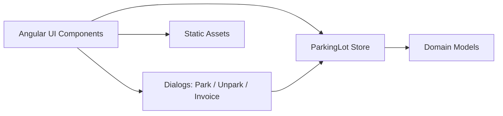

# Parking Lot Architecture (Phase A)

## 1. Purpose

This document describes the **high-level system architecture** of the Parking Lot application.

Phase A focuses on a **simple, single-application architecture** with:

- In-memory state (frontend store)
- Clear domain boundaries
- No backend persistence yet (API-ready design)

The goal is **clarity, separation of concerns, and future scalability**.

---

## 2. Architectural Principles

- UI is dumb; business logic lives in the Store
- Domain rules are centralized
- One-way data flow
- Immutable records for tickets and invoices
- API-first mindset (even before backend exists)

---

## 3. System Overview (Phase A)

### Components

- **Angular UI**
- **Signal Store (Application State)**
- **Dialog Layer**
- **Domain Models**
- **Static Assets**

All logic currently runs in the frontend, but boundaries are designed to map directly to a backend later.

---

## 4. High-Level Architecture Diagram

