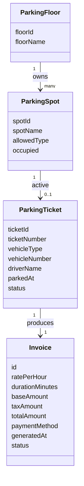

# Parking Lot Domain (Phase A)

## 1. Overview

This document defines the **core business domain** for the Parking Lot application.

- UI-agnostic
- Framework-agnostic
- Database-agnostic

Phase A focuses on a **simple, immutable domain model** that is easy to reason about,
test, and extend in later phases.

---

## 2. Roles

### Admin

- Can manage floors and parking spots
- Can view all tickets and invoices
- Has full system visibility
- Can perform reporting and audits

### Operator

- Can park and unpark vehicles
- Can generate tickets and invoices
- Cannot modify floors or spots
- Sees limited sensitive data only

---

## 3. Core Entities

### Floor

- Represents a physical parking floor
- Contains multiple parking spots
- Created and modified only by Admin
- Floor identity is stable over time

---

### Spot

- Belongs to exactly one floor
- Has an allowed vehicle type (CAR / BIKE / TRUCK)
- Can be either:
  - `Available`
  - `Occupied`
- Spot configuration is immutable while a vehicle is parked

---

### Ticket

- Created when a vehicle is parked
- Represents an **active parking session**
- Exactly one active ticket can exist per spot
- Contains:
  - Ticket number
  - Vehicle number
  - Driver name
  - Vehicle type
  - Floor & spot reference
  - Parked timestamp
- Ticket is **closed** when vehicle is unparked
- Tickets are never deleted (audit-safe)

---

### Invoice

- Exactly **one invoice per ticket**
- Generated when a vehicle is unparked
- Invoice is **immutable**
- Stored permanently for:
  - Reporting
  - Auditing
  - Re-download
- Invoice contains a **snapshot** of ticket data
- PDF is generated **on demand**, not stored

---

## 4. Business Rules (Phase A)

- One ticket always produces exactly one invoice
- Invoice is generated once and cannot be edited
- Tickets have two states:
  - `ACTIVE`
  - `CLOSED`
- A spot can have **only one active ticket**
- Spot deletion is not allowed if historical tickets exist
  (enforced later at DB level)
- Financial values are calculated once and locked

---

## 5. Financial Rules

- Rate is calculated per hour
- Partial hours are **rounded up**
- Tax is calculated at a fixed rate (18%)
- Total amount = Base amount + Tax
- All monetary values are stored, not recomputed

---

## 6. Domain Model Diagram

