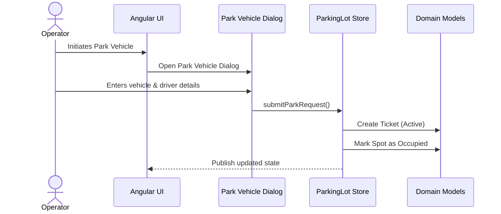
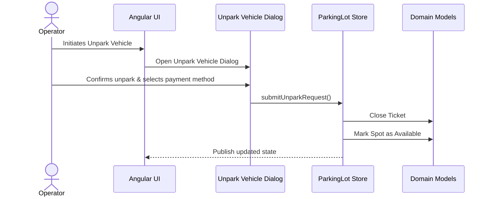
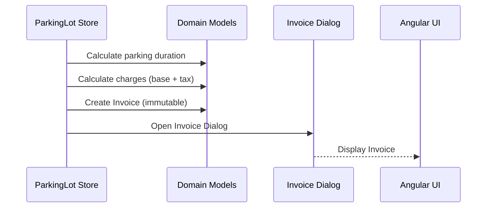

# Parking Lot – Sequence Flows (Phase A)

## 1. Purpose

This document describes the **runtime behavior and interaction flows**
of the Parking Lot application.

⚠️ Phase A is documented **incrementally**.
Only validated flows are added and locked.

Currently completed:

- ✅ Park Vehicle flow
- ✅ Unpark Vehicle flow
- ✅ Invoice Generation flow

---

## 2. Actors & Components

- **Operator** – Human user operating the parking system
- **UI** – Angular pages & components (interaction layer)
- **Dialog** – Modal dialogs (Park / Unpark / Invoice)
- **Store** – ParkingLotStore (business orchestration & state)
- **Domain** – Domain models (Spot, Ticket, Invoice)

---

## 3. Park Vehicle Sequence (LOCKED)

### Description

A vehicle arrives at the parking lot.

The system:

- Creates a **Ticket**
- Marks the **Spot as Occupied**
- Transitions the system into an **Active Parking state**

No invoice is generated during this flow.

### Sequence Diagram

### Rules Enforced

- A ticket is created **only once per parking session**
- A spot **cannot be parked** if already occupied
- Parking does **not** generate an invoice
- Spot configuration is immutable during active parking

### State Transitions

| Entity | Before    | Action | After    |
| ------ | --------- | ------ | -------- |
| Spot   | Available | Park   | Occupied |
| Ticket | None      | Park   | Active   |

---

## 4. Unpark Vehicle Sequence (LOCKED)

### Description

A parked vehicle exits the parking lot.

The system:

- Validates that an **active ticket exists**
- Closes the **Ticket**
- Marks the **Spot as Available**
- Triggers invoice generation

### Sequence Diagram

### Rules Enforced

- Only **active tickets** can be unparked
- A spot must be **occupied** to allow unpark
- Ticket is closed **exactly once**
- No spot remains occupied after unpark

### State Transitions

| Entity | Before   | Action | After     |
| ------ | -------- | ------ | --------- |
| Ticket | Active   | Unpark | Closed    |
| Spot   | Occupied | Unpark | Available |

---

## 5. Invoice Generation Flow (LOCKED)

### Description

After a vehicle is unparked, the system generates an invoice.

The system:

- Calculates parking duration
- Calculates payable amount
- Creates an immutable Invoice
- Stores Invoice permanently
- Displays Invoice

### Sequence Diagram

### Rules Enforced

- Exactly **one Invoice per Ticket**
- Invoice is generated **only once**
- Invoice is **immutable**
- Invoice does not affect Spot state

### Financial Rules

- Duration calculated in minutes
- Partial hours rounded up
- Fixed hourly rate (Phase A)
- Fixed tax percentage
- Total = Base + Tax

### State Transitions

| Entity  | Before    | Action           | After     |
| ------- | --------- | ---------------- | --------- |
| Ticket  | Closed    | Generate Invoice | Closed    |
| Invoice | None      | Generate         | Generated |
| Spot    | Available | None             | Available |

---

## 6. Phase A Discipline

- Behavior-first documentation
- One flow locked at a time
- Explicit state transitions
- Documentation is the source of truth
