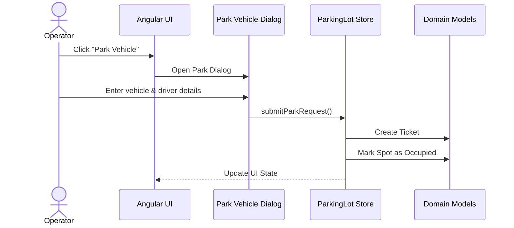
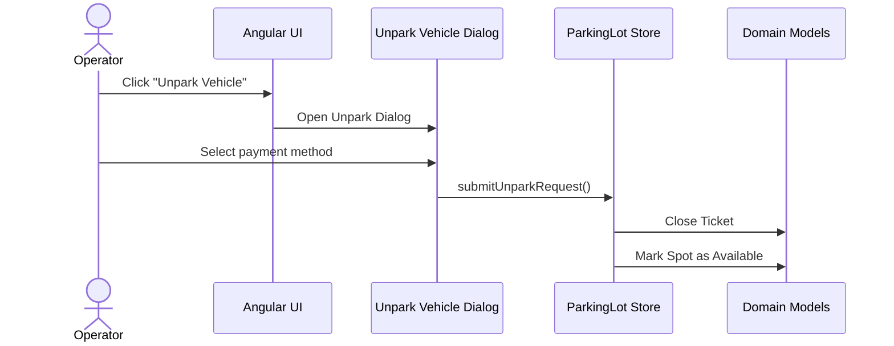
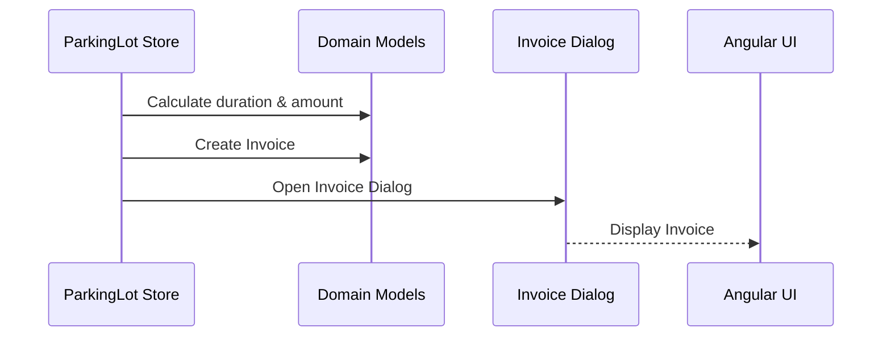

# Parking Lot – Sequence Flows (Phase A)

## 1. Purpose

This document describes the runtime behavior and interaction flow of the Parking Lot application.

It focuses on:

- Park Vehicle flow
- Unpark Vehicle flow
- Invoice generation flow

Phase A assumptions:

- Frontend-only execution (Angular + Signal Store)
- Centralized Store acts as the system brain
- Ticket → Invoice lifecycle is immutable

---

## 2. Actors & Components

- Operator – Human user operating the parking system
- UI – Angular pages & components
- Dialog – Modal dialogs (Park / Unpark / Invoice)
- Store – ParkingLotStore (business orchestration)
- Domain – Domain models (Spot, Ticket, Invoice)

---

## 3. Park Vehicle Sequence

### Description

A vehicle arrives at the parking lot.
The operator parks the vehicle and a Ticket is created.
The Spot becomes Occupied.

Rules Enforced:

- Ticket is created only once
- Spot cannot be parked while occupied
- No invoice during parking

---

## 4. Unpark Vehicle Sequence

### Description

The operator unparks a vehicle.
The Ticket is closed and the Spot becomes Available.

Rules Enforced:

- Only active tickets can be unparked
- Spot is freed after unpark

---

## 5. Invoice Generation Sequence

### Description

Invoice is generated exactly once after unpark.
Invoice is immutable.

Rules Enforced:

- One invoice per ticket
- Invoice cannot be edited
- PDF generated on demand

---

## 6. State Transitions Summary

| Entity  | Before    | Action | After     |
| ------- | --------- | ------ | --------- |
| Spot    | Available | Park   | Occupied  |
| Ticket  | None      | Park   | Active    |
| Ticket  | Active    | Unpark | Closed    |
| Spot    | Occupied  | Unpark | Available |
| Invoice | None      | Unpark | Generated |

---

## 7. Phase A Guarantees

- Deterministic lifecycle
- Explicit state transitions
- Backend-ready design

---

## 8. Out of Scope

- Refunds or adjustments
- Re-opening tickets
- Audit logs
- Async backend workflows
